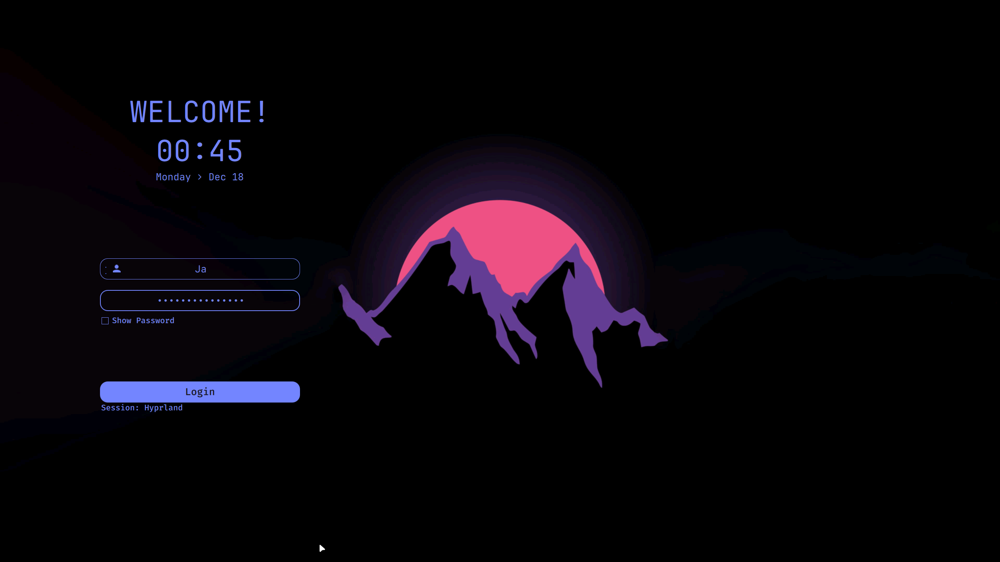
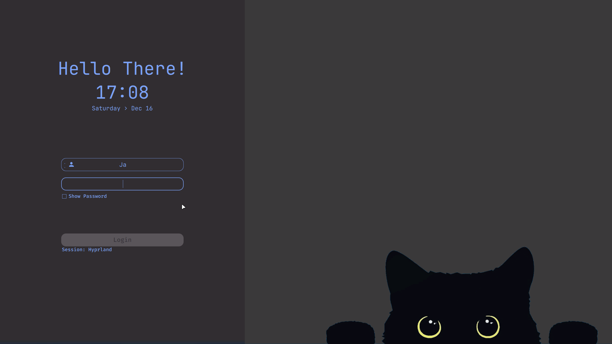
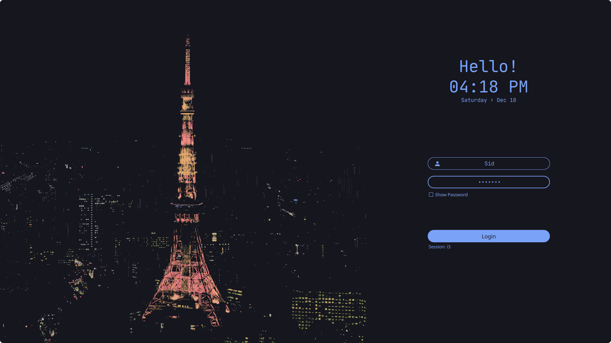
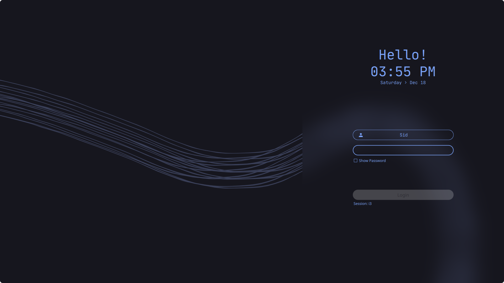
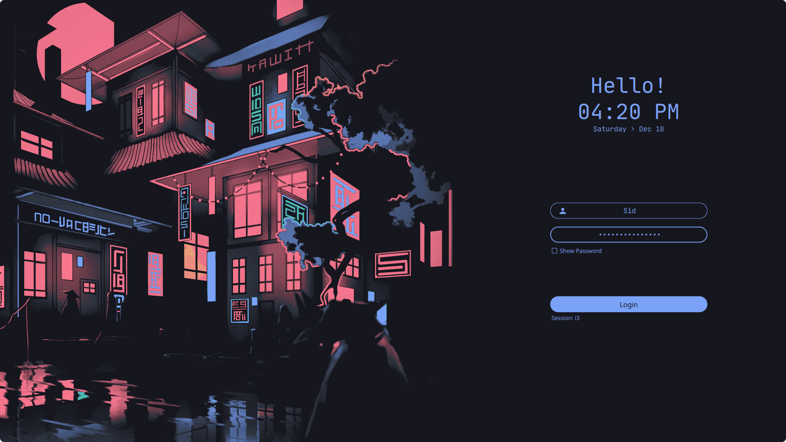

<h2 align="center">🗼 Simple SDDM Theme 🗼</h2>

<h1 align="center"> A Minimalist SDDM Theme for Linux Systems </h1>

<p align="center">
A simple yet elegant theme variant for the <a href="https://github.com/sddm/sddm">SDDM Login Manager</a>.
</p>

<h2 align="center">Preview</h2>
<p align="center">
  
</p>
<p align="center">
  <details>
    <summary>More Previews</summary>
    
    
    
    
  </details>
</p>

## Installation

### From sources

> _Assumes that you've installed and configured SDDM correctly_ (if not [read more](https://wiki.archlinux.org/title/SDDM))

>  Please make sure you have the following dependencies installed:
>  `qt5-quickcontrols2`, `qt5-graphicaleffects`, `qt5-svg` 

1. Open a terminal and clone the repository:

   ```bash
   git clone https://github.com/bewithsnehasish/sddm-config.git

2. Then move it as follows:

   ```bash
   sudo mv ~/sddm-config /usr/share/sddm/themes/
   ```
## Configure

Edit the `/etc/sddm.conf.d/10-theme.conf` (with any text editor with **raised** privileges), so that it looks like this:

```bash
sudo nano /etc/sddm.conf.d/10-theme.conf  # use any text editor with raised privileges
---

[Theme]
Current=sddm-config
   ```


### Language and time format
- By default, it is configured with 24H format. You can change to AM/PM variant by editing the theme.conf
```bash
sudo nano /usr/share/sddm/themes/sddm-config/theme.conf  # use any text editor with raised privileges
```
- `HourFormat="hh:mm AP` . Make sure to disable the above of this part
- To change the default wallpaper put desired image in the `sddm-config/` folder and add the name of the image followed by its extension (`.jpg` or `.png`) in `theme.conf` file.
- You can also customize it further if you wish in the `theme.conf`
(blur, form position, etc).

## Wallpaper Rotation

This theme supports automatic wallpaper rotation, allowing you to add variety to your login screen. Follow these steps to set it up:

1. **Download Wallpaper Images**: Download all the images you want to include in the rotation and store them in a folder named "backgrounds". You can choose images from your preferred sources or create your own. Ensure the images are in common formats like JPG or PNG and are suitable for display on your login screen.

2. **Prepare Script Folder**:
   - Open a terminal and navigate to your home directory:
     ```bash
     cd
     ```
   - Create a hidden folder named `.Scripts` to store your wallpaper rotation script:
     ```bash
     mkdir .Scripts
     ```

3. **Move Wallpaper Rotation Service**:
   - Navigate back to the SDDM config cloned folder from GitHub:
     ```bash
     cd /usr/share/sddm/themes/sddm-config/
     ```
   - Move the `sddmbg.service` file to the `.Scripts` folder:
     ```bash
     sudo mv newbg.service ~/.Scripts
     ```

4. **Prepare Wallpaper Rotation Service**:
   - Navigate to the `.Scripts` folder:
     ```bash
     cd ~/.Scripts
     ```
   - Make the `sddmbg.service` file executable:
     ```bash
     chmod +x sddmbg.service
     ```
   - Start the wallpaper rotation service:
     ```bash
     sudo systemctl start sddmbg.service
     ```

6. **Restart SDDM**: After making these changes, restart the SDDM service for the changes to take effect:
   ```bash
   sudo systemctl restart sddm
## Contributing

Contributions are welcome! If you'd like to contribute to this project, please read the [Contributing Guidelines](CONTRIBUTING.md) before submitting any pull requests.

## Contact

If you have any questions, suggestions, or issues, feel free to reach out to the project maintainer:

- [GitHub Issues](https://github.com/bewithsnehasish/sddm-config/issues): For bug reports, feature requests, or general questions.
- [Email](mailto:mandalsneh97@gmail.com): For private communications.

Your feedback is highly appreciated!

---

Enjoy your customized SDDM login experience with this theme!
